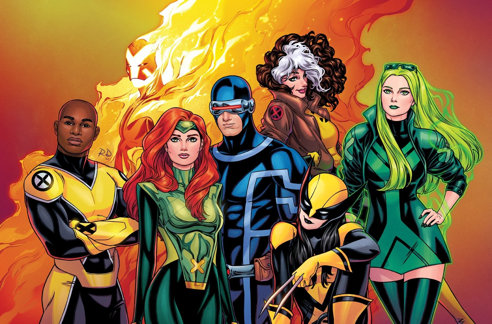

# X-Men

**Membros atuais**: Ciclope, Wolverine, Jean Grey, Sincro, Polaris, Solaris e Vampira

**Descrição**: Atualmente os X-Men são uma equipe oficial que representa Krakoa, a nação mutante. E todos os anos, durante a cerimônia do Hellfire Gala, a população elege uma nova formação para seguir lhes representando. Inclusive, um integrante da equipe é sempre eleito via voto popular pelos leitores.

[Voltar para página inicial](README.md)